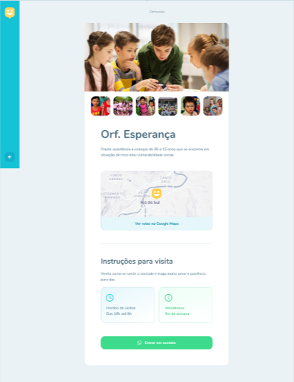

# Happy -NLW#03

Projeto criado com a ideia de facilitar a interação entre orfanatos e seus visitantes que muitas vezes querem visitar e nem  sequer sabem onde pode haver um orfanato proximo. Nesse site os orfanatos pode cadastra sua localização, seu horario de funcionamento e colocar até masmo mais informações como imagens pra mostra um pouco o que espera pelo visitante e mostrar instruções.

## tecnologias utilizadas:
- NVM.
- express - OBS: tive que remover os as pastas do express por conta que eu não conssegui upa tudo, mais abaixo no HEADME mostra como reinstala-las.
- SQL lite
- instale todas as dependencias com:
```
npm i
```
<p>para acessar o site no projeto, dê (vscode)</p> 

```
npm start
```
<p>depois digite no navegador</p>

```
localhost:5500
```
se quiser mudar o endereço no localhost olhe o arquivo server.js 

<h2>imagens do projeto:</h2>

<div>
<div display="flex">


</div>
<div display="flex">



</div>
</div>


Uma maneira fácil de alterar a versão do seu node no Linux/Mac é utilizando o NVM. Com ele você pode ter várias versões do node diferentes, instaladas na mesma máquina e escolher a melhor para cada momento.

Se você já tiver o node instalado, rode o comando abaixo para remover ele completamente para que possamos instalar pelo NVM:

sudo apt-get purge --auto-remove nodejs


Agora vamos instalar o NVM e o Node.js versão LTS.

Para instalar, siga os passos abaixo:

1 - Abra um novo terminal e execute o comando abaixo:

```
curl -o- https://raw.githubusercontent.com/nvm-sh/nvm/v0.36.0/install.sh | bash
```

2 - Agora copie esse código e cole no seu terminal: 

```
export NVM_DIR="$([ -z "${XDG_CONFIG_HOME-}" ] && printf %s "${HOME}/.nvm" || printf %s "${XDG_CONFIG_HOME}/nvm")" [ -s "$NVM_DIR/nvm.sh" ] && \. "$NVM_DIR/nvm.sh" # This loads nvm
```

3 - Reinicie o seu terminal e execute o comando abaixo. Deve retornar um número de versão. Isso significa que foi instalado com sucesso.

```
nvm --version
```

- 4 - Para instalar a versão LTS do node, rode o comando abaixo: *

```
nvm install --lts
```

5 - Agora para definir e usar essa versão por padrão, rode o seguinte:

```
nvm alias default 12.19.0
```
